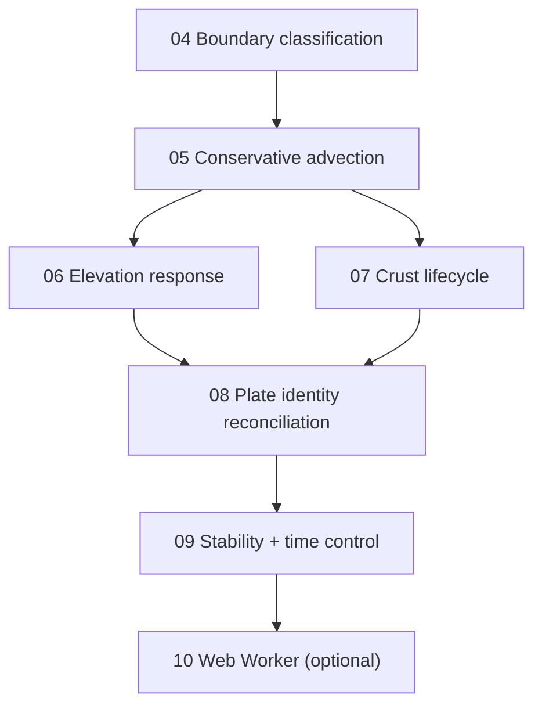

# Movement & Interaction — Iteration Overview

Tickets to take plate tectonics from "crust slides around" (done in
`completedTasks/03-plateMoement.md`) to "plates genuinely interact and build
terrain". Each ticket is intentionally light on implementation — those details
are planned per ticket when picked up.

## Where we are

Movement works: plates rotate about their Euler poles and crust advects across
the fixed grid, with `plateId` riding along so boundaries are emergent. What is
missing is everything that makes movement *mean* something — boundaries do not
yet interact, no terrain forms, and crust is not conserved.

## The core problem these tickets solve

The current advection is not conservative and has no boundary behaviour. Every
destination cell independently pulls from a source, which silently produces two
artefacts at boundaries:

- **Convergence:** two cells pull from the same source -> crust is duplicated,
  not piled up or subducted.
- **Divergence:** a cell whose plate pulls away pulls from a stale neighbour ->
  a gap that should be a new rift just smears old crust.

The bulk of this iteration is turning those two artefacts into modelled geology.
This is the heart of the feature and the hardest tuning problem.

## Guiding principles (from the design doc)

- The simulation step stays a pure function over typed arrays (Worker/WASM-ready).
- The mesh never moves; only data advects.
- Sim-driven and player-driven writes share the same data path.
- Conservation matters over deep time — track it from the start, even if loosely.

## Cross-cutting decisions to lock during planning

These shape several tickets, so resolve them before building 05-07:

1. **Conservation strategy** — how convergence/divergence are detected and how
   mass is moved without duplication or loss.
2. **Rift crust ownership** — new crust inherits the spreading plate's id, or
   mints new plates.
3. **Subduction rule** — strictly density-driven, or also age/type heuristics.
4. **How geologically literal** to be now vs. tuneable fudge factors. Ticket 06
   is the big tuning sink; lean on simple, monotonic rules first and expose the
   constants.

## Sequencing

04 and the conservation decision unblock everything; 06 and 07 are the visible
payoff; 08-09 make it robust for deep time.

## Out of scope this iteration

- Player manipulation tools (direct elevation/velocity/plate-id editing).
- Voronoi mesh upgrade.
- Erosion / sediment / climate.
